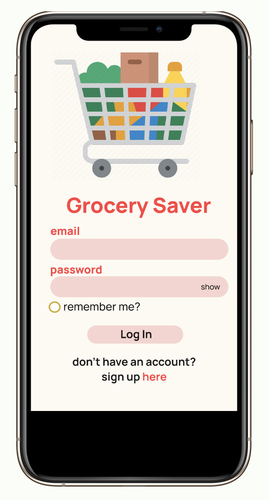
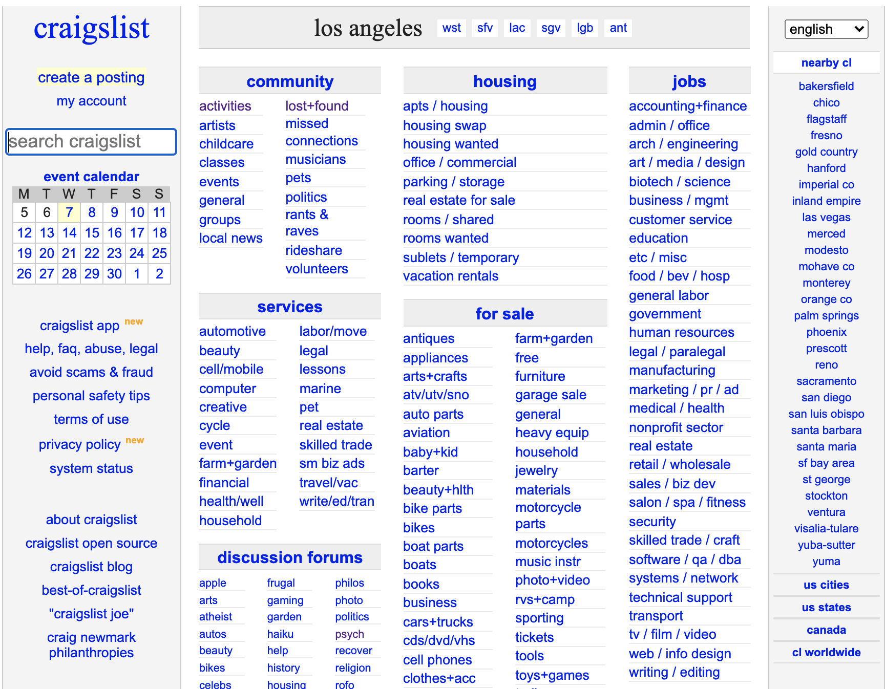
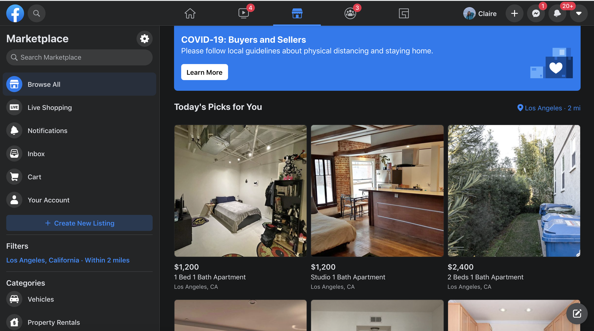
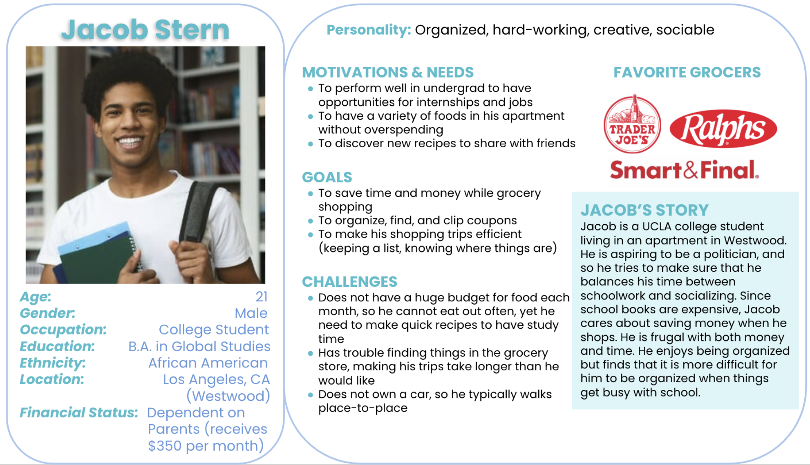
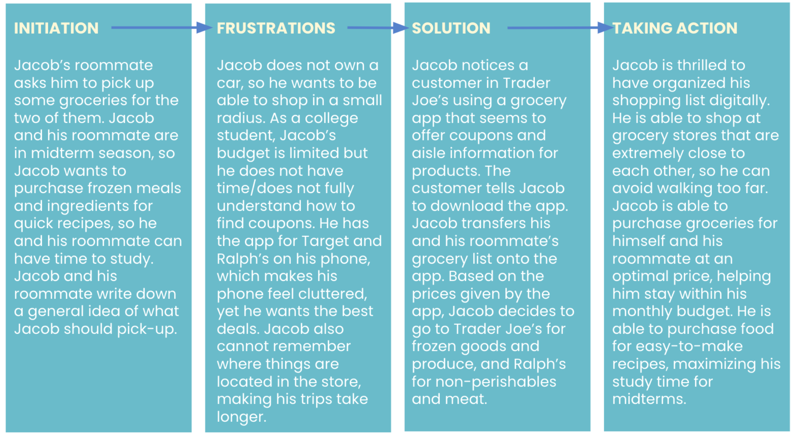
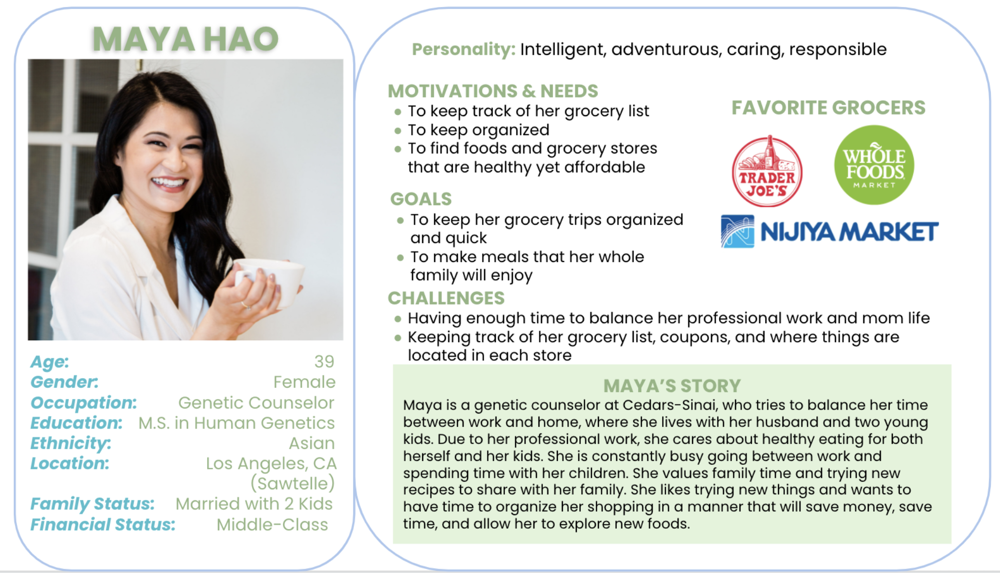
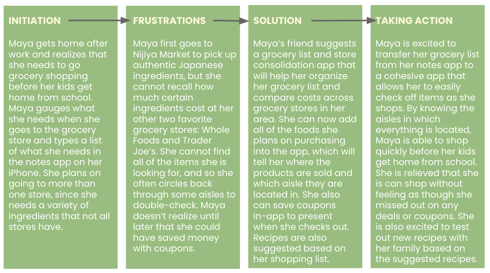

 
 

 
###### *Credit: GETTY Images*

# Grocery Saver
DH110 UX/UI Project by Claire Dinauer

 
 

## Introduction
*What is the project about? The motivation of the project and possible contribution.*

This quarter, I focused on creating a UX Project that could assist both younger and older adults with saving money, increasing organization, maximizing efficiency, and expanding their horizons to take advantage of what their grocery stores have to offer. Planning shopping trips 

This project will support users in their ability to create a grocery shopping list that enables them to minimize their number of trips to different grocery stores, while maximizing savings. This will particularly help younger and older adults who live in areas with multiple grocery store options figure out where they can get the best deals for the items on their grocery lists. The 

## Design Statement 
Many individuals, whether college-aged or adults with families, are looking for ways to save money and focus their time on tasks and activities that necessary errands take time away from. Particularly, grocery shopping is an errand that all-ages need to get done at least a couple of times each month. As college students, parents with kids to feed, or simply adults looking to save money, grocery costs can add up. Undoubtedly, groceries typically cost less than eating out, and so all some people need is a nudge to organize their coupons and take advantage of learning easy, accessible recipes to make for themselves or their families. Plus, finding certain products in different grocery stores can be a hassle, and it is extra frustrating when you purchase an item at one store, only to realize that another store sells it for less.

The Grocery Saver app particularly resolves these stresses of grocery shopping, enabling users to compare prices across stores, create and save shopping lists, note aisles of each product, save coupons, and discover recipes. These features exclusively compiled into the Grocery Saver platform overall save shoppers both time and money, giving college students more time to study or see friends and giving families a fun budget- and time-friendly shopping experience.

This project appeals to users' esteem needs, involving a sense of prestige and a feeling of accomplishment by maximizing their savings and exploring new recipes. While the project may seem to address physiological needs on the surface due to its enhancement of food accessibility and costs, the project overarchingly targets users' esteem needs because users are likely to feel more accomplished after completing their grocery shopping in a timely, costly manner. Overall, this project is important and useful to all users by increasing organization and accessibility to a positive shopping and cooking experience catered to each user.

## Competitor Analysis 

### Craigslist and Facebook Marketplace Summaries
I chose to look at Craigslist and Facebook Marketplace to delve into what makes a "community marketplace" user-friendly and safe for a wide range of age groups, and what may need to be improved to optimize safety, accessibility, and overall site design. Scrolling through Craigslist myself in the past, I consistently found fishy listings, sometimes many of the same exact listing, with poor or unclear options for contacting the lister that required little-to-no verification of identity. Since attending college, my eyes have been opened to different local virtual marketplaces that made being a college student easier and more affordable, specifically in terms of purchasing textbooks from other students for my classes or purchasing used furniture for my apartment. I, along with many other university students, use Facebook Marketplace to post listings of our items to students or other individuals within a certain radius of our loaction. 

Looking at these two websites helped me think about what I would want my own platform to look like when designing a type of "community marketplace," or a site or app in which users could have easy, trustworth access to information about products in their area.

#### [**Craigslist**](https://losangeles.craigslist.org/)

Craigslist is a website for viewing and posting advertisements or listings devoted to jobs, housing, for sale, items wanted, services, community service, gigs, resumes, and discussion forums. The site lacks aesthetic organization, especially due to its cluttered style and lack of engaging visualizations that could make the site easier to navigate. While the website is newspaper-esque, it could use some updates to be more visually appealing, in which certain enhancements could make navigating the site easier. The website also has a notably high scam and setup rate, which makes it risky for elder populations and younger children or teens to use who may be less familiar with navigating scams.

 
 

#### [**Facebook Marketplace**](https://www.facebook.com/marketplace/)

Facebook Martketplace is an open exchange where users can buy and sell new and pre-owned items to other users, in which searches can be narrowed based on location. Any users can list products or services for sale and gain access to a local audience. The website also groups items or forums into categories, such as electronics, clothing, family, free items, hobbies, real estate, and supplies. Facebook Marketplace is notably more visually appealing and simple to navigate for both buyers and sellers. The use of an algorithm to offer "Picks for You" could use improvements, as it may be based on slim availability of data based on a user's former activity. Because Facebook originated as a social media platform to enhance community, Facebook Marketplace is able to combine the community aspects of their site to make selling feel more personable and safe. The ability to directly message other users through the marketplace platform make seller and buyer identities more verifiable. The platform aims to be user-friendly by generating automated potential responses to listings in the marketplace. There are fewer improvements for the site to make in comparison to Craigslist.

 
 

[**Read more about my evaluation of these two platforms here**](https://github.com/clairedinauer/DH110-Dinauer/tree/main/assignment1).

### Summary of Pilot Usability Test with Craigslist

I conducted a Usability Test (UT) with Craigslist to observe how people use the website, while gaining a greater understanding of a product’s effectiveness, efficiency, and satisfaction. This UT allowed me to identify what users found good or bad about the site design. Practicing a UT with a website such as Craislist helped me get used to the process of interviewing users and learning what information I wanted to get out of users for my own project. This also helped me with curating my own UT tasks to observe my participants' behaviors, attitudes, and thoughts while navigating my product.

[**Read more about my Usability Test here**](https://github.com/clairedinauer/DH110-Dinauer/tree/main/assignment2).

## User Research 

> **Demographics**: Adults, people with families, students (high school or above), older adults, or elders
> 
> **Preferences**: Users who try to have organized, efficient shopping trips; users who try to go to more than one store to purchase different products; users who try to get the best price when shopping (e.g. clipping coupons, price comparisons)
> 
> **Expertise**: Users do not need a specific level of expertise for this project other than having the experience of grocery shopping

This project will support users in their ability to create a grocery shopping list that enables them to minimize their number of trips to different grocery stores, while maximizing savings. This will particularly help younger and older adults who live in areas with multiple grocery store options figure out where they can get the best deals for the items on their grocery lists.

During the inquiry, I gave the user two tasks to complete:
1. Creating a grocery list by-hand (pen and paper): I asked the user to organize their shopping list as they normally would when going to the grocery store. I asked questions regarding why the user set up their list a certain way.
2. Creating a grocery list in-app (Ralph's App): I asked the user to create a shopping list in the Ralph's app and play around with the interface. I asked questions regarding the reliability and usability of the app to understand the user's preferences.

My participant's active description of what she was doing during each task allowed me to better understand the thought process of users when creating shopping lists, whether written or digital. Additionally, I enjoyed the feedback and values that the participant shared while using the Ralph's app, as this allowed me to think more about how to maximize the ease and efficiency of creating a digital shopping list for consumers to use across different grocery store locations.

[**Read More about my Contextual Inquiry here**](https://github.com/clairedinauer/DH110-Dinauer/tree/main/assignment3)

## UX Storytelling 

The purpose of UX storytelling is to better understand the user by considering their world view and perspective when encountering different aspects of life. UX storytelling enables design teams to create personas based on their target audience, allowing them to consider the behaviors, thoughts, and environments of their users. Storytelling opens the door to considering user's emotions as they navigate scenarios that are relevant to the product. This allows teams to combine a range of consumer experiences to develop a dynamic, user-friendly product.

 
 
 

 
 

 
 
 

 
Above, you can see the two personas I created, Jacob Stern and Maya Hao, to demonstrate how some of my target users may use the Grocery Saver platform. I specifically focused on the following key design features for the scenarios I created for Jacob and Maya:
1. Digital shopping list with suggested coupons and recipe recommendations for each product
2. Aisle labeling for each product in the shopping list

[**Read more about UX Storytelling here**](https://github.com/clairedinauer/DH110-Dinauer/tree/main/assignment4)

## Wireframe and Graphic Design Element Variation 

 

 
 

[**Wireframe and Low-Fidelity Prototype**](https://github.com/clairedinauer/DH110-Dinauer/tree/main/assignment5)

[assignment06 + part of 07]

[**Assignment 6**](https://github.com/clairedinauer/DH110-Dinauer/tree/main/assignment6)

[**Assignment 7**](https://github.com/clairedinauer/DH110-Dinauer/tree/main/assignment7)

## Low-Fidelity Prototype 
(wireflow, assignment06)

The purpose for conducting a low-fidelity prototype is to test the functionality and ease-of-usability of the features that I designed with my target audience in mind. I wanted to gauge the efficiency of each of the features and understand what may be confusing to users, allowing me to figure out what I may need to adjust in my GrocerySaver application to ensure that users get the most out of each feature and the application as a whole.

*Summary and link to the sketches (may contains the multiple versions and evaluation history)*

[**Assignment 6**](https://github.com/clairedinauer/DH110-Dinauer/tree/main/assignment6)

## High-Fidelity Prototype 
(functional/interactive prototype, assignment08)
*Summary statement and link to or an embedded prototype*

<iframe style="border: 1px solid rgba(0, 0, 0, 0.1);" width="800" height="450" src="https://www.figma.com/embed?embed_host=share&url=https%3A%2F%2Fwww.figma.com%2Fproto%2FLLdDPIvlSZuc4WtEQ4rh4c%2FHigh-Fidelity%3Fnode-id%3D203%253A23%26scaling%3Dscale-down%26page-id%3D0%253A1" allowfullscreen></iframe>

[**Assignment 8**](https://github.com/clairedinauer/DH110-Dinauer/tree/main/assignment7)

## Optional evaluation and revision history 
*Including cognitive walkthrough; impression test, accessibility audit, usability testing), per each summary and link to the notes (when you share the video or other detailed evidences, I will notify you when you can make the contents private as soon as your work is graded)*

## Pitch Video 

## Conclusion 
what did you learn throughout the process?

[Read more…](https://clairedinauer.github.io/DH110-Dinauer/assignment8/README.md)
