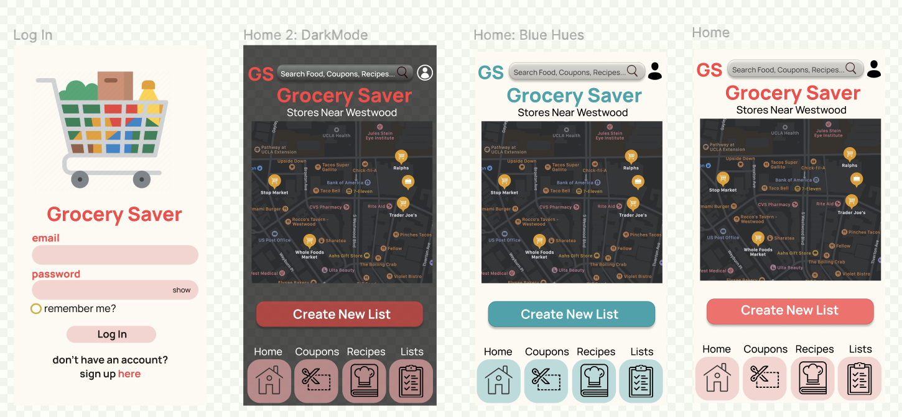

 
 

 
###### *Credit: GETTY Images*

# Grocery Saver
DH110 UX/UI Project by Claire Dinauer

 
 

## Introduction
This quarter, I focused on creating a UX Project that could assist both younger and older adults with saving money, increasing organization, maximizing efficiency, and expanding their horizons to take advantage of what their grocery stores have to offer. This project will support users in their ability to create a grocery shopping list that enables them to minimize their number of trips to different grocery stores, while maximizing savings. This will particularly help younger and older adults who live in areas with multiple grocery store options figure out where they can get the best deals for the items on their grocery lists. 

Because applications for larger stores are specific to providing information regarding products and costs at that one store, an application that utilizes algorithms to compare costs of products and produce across multiple grocery stores will enable users to find the products that they are looking for at the lowest cost. In addition, rather than feeling limited to shopping at one store, users could set location preferences for where they would like to do their grocery shopping within a certain radius, as well as how many stores they may be willing to go to, in order to curate a shopping experience that works best for their time and wallet.

## Design Statement 
Many individuals, whether college-aged or adults with families, are looking for ways to save money and focus their time on tasks and activities that necessary errands take time away from. Particularly, grocery shopping is an errand that all-ages need to get done at least a couple of times each month. As college students, parents with kids to feed, or simply adults looking to save money, grocery costs can add up. Undoubtedly, groceries typically cost less than eating out, and so all some people need is a nudge to organize their coupons and take advantage of learning easy, accessible recipes to make for themselves or their families. Plus, finding certain products in different grocery stores can be a hassle, and it is extra frustrating when you purchase an item at one store, only to realize that another store sells it for less.

The Grocery Saver app particularly resolves these stresses of grocery shopping, enabling users to compare prices across stores, create and save shopping lists, note aisles of each product, save coupons, and discover recipes. These features exclusively compiled into the Grocery Saver platform overall save shoppers both time and money, giving college students more time to study or see friends and giving families a fun budget- and time-friendly shopping experience.

This project appeals to users' esteem needs, involving a sense of prestige and a feeling of accomplishment by maximizing their savings and exploring new recipes. While the project may seem to address physiological needs on the surface due to its enhancement of food accessibility and costs, the project overarchingly targets users' esteem needs because users are likely to feel more accomplished after completing their grocery shopping in a timely, costly manner. Overall, this project is important and useful to all users by increasing organization and accessibility to a positive shopping and cooking experience catered to each user.

## Competitor Analysis 

### Craigslist and Facebook Marketplace Summaries
I chose to look at Craigslist and Facebook Marketplace to delve into what makes a "community marketplace" user-friendly and safe for a wide range of age groups, and what may need to be improved to optimize safety, accessibility, and overall site design. Scrolling through Craigslist myself in the past, I consistently found fishy listings, sometimes many of the same exact listing, with poor or unclear options for contacting the lister that required little-to-no verification of identity. Since attending college, my eyes have been opened to different local virtual marketplaces that made being a college student easier and more affordable, specifically in terms of purchasing textbooks from other students for my classes or purchasing used furniture for my apartment. I, along with many other university students, use Facebook Marketplace to post listings of our items to students or other individuals within a certain radius of our loaction. 

Looking at these two websites helped me think about what I would want my own platform to look like when designing a type of "community marketplace," or a site or app in which users could have easy, trustworth access to information about products in their area.

#### [**Craigslist**](https://losangeles.craigslist.org/)

Craigslist is a website for viewing and posting advertisements or listings devoted to jobs, housing, for sale, items wanted, services, community service, gigs, resumes, and discussion forums. The site lacks aesthetic organization, especially due to its cluttered style and lack of engaging visualizations that could make the site easier to navigate. While the website is newspaper-esque, it could use some updates to be more visually appealing, in which certain enhancements could make navigating the site easier. The website also has a notably high scam and setup rate, which makes it risky for elder populations and younger children or teens to use who may be less familiar with navigating scams.

 
 

#### [**Facebook Marketplace**](https://www.facebook.com/marketplace/)

Facebook Martketplace is an open exchange where users can buy and sell new and pre-owned items to other users, in which searches can be narrowed based on location. Any users can list products or services for sale and gain access to a local audience. The website also groups items or forums into categories, such as electronics, clothing, family, free items, hobbies, real estate, and supplies. Facebook Marketplace is notably more visually appealing and simple to navigate for both buyers and sellers. The use of an algorithm to offer "Picks for You" could use improvements, as it may be based on slim availability of data based on a user's former activity. Because Facebook originated as a social media platform to enhance community, Facebook Marketplace is able to combine the community aspects of their site to make selling feel more personable and safe. The ability to directly message other users through the marketplace platform make seller and buyer identities more verifiable. The platform aims to be user-friendly by generating automated potential responses to listings in the marketplace. There are fewer improvements for the site to make in comparison to Craigslist.

 
 

[**Read more about my evaluation of these two platforms here**](https://github.com/clairedinauer/DH110-Dinauer/tree/main/assignment1).

### Summary of Pilot Usability Test with Craigslist

I conducted a Usability Test (UT) with Craigslist to observe how people use the website, while gaining a greater understanding of a product’s effectiveness, efficiency, and satisfaction. This UT allowed me to identify what users found good or bad about the site design. Practicing a UT with a website such as Craislist helped me get used to the process of interviewing users and learning what information I wanted to get out of users for my own project. This also helped me with curating my own UT tasks to observe my participants' behaviors, attitudes, and thoughts while navigating my product.

[**Read more about my Usability Test here**](https://github.com/clairedinauer/DH110-Dinauer/tree/main/assignment2).

## User Research 

This project will support users in their ability to create a grocery shopping list that enables them to minimize their number of trips to different grocery stores, while maximizing savings. This will particularly help younger and older adults who live in areas with multiple grocery store options figure out where they can get the best deals for the items on their grocery lists.

> **Demographics**: Adults, people with families, students (high school or above), older adults, or elders
> 
> **Preferences**: Users who try to have organized, efficient shopping trips; users who try to go to more than one store to purchase different products; users who try to get the best price when shopping (e.g. clipping coupons, price comparisons)
> 
> **Expertise**: Users do not need a specific level of expertise for this project other than having the experience of grocery shopping

During the inquiry, I gave the user two tasks to complete:
1. Creating a grocery list by-hand (pen and paper): I asked the user to organize their shopping list as they normally would when going to the grocery store. I asked questions regarding why the user set up their list a certain way.
2. Creating a grocery list in-app (Ralph's App): I asked the user to create a shopping list in the Ralph's app and play around with the interface. I asked questions regarding the reliability and usability of the app to understand the user's preferences.

My participant's active description of what she was doing during each task allowed me to better understand the thought process of users when creating shopping lists, whether written or digital. Additionally, I enjoyed the feedback and values that the participant shared while using the Ralph's app, as this allowed me to think more about how to maximize the ease and efficiency of creating a digital shopping list for consumers to use across different grocery store locations.

[**Read More about my Contextual Inquiry here**](https://github.com/clairedinauer/DH110-Dinauer/tree/main/assignment3)

## UX Storytelling 

The purpose of UX storytelling is to better understand the user by considering their world view and perspective when encountering different aspects of life. UX storytelling enables design teams to create personas based on their target audience, allowing them to consider the behaviors, thoughts, and environments of their users. Storytelling opens the door to considering user's emotions as they navigate scenarios that are relevant to the product. This allows teams to combine a range of consumer experiences to develop a dynamic, user-friendly product.

 
 
 

 
 

 
 
 

 
Above, you can see the two personas I created, Jacob Stern and Maya Hao, to demonstrate how some of my target users may use the Grocery Saver platform. I specifically focused on the following key design features for the scenarios I created for Jacob and Maya:
1. Digital shopping list with suggested coupons and recipe recommendations for each product
2. Aisle labeling for each product in the shopping list

[**Read more about UX Storytelling here**](https://github.com/clairedinauer/DH110-Dinauer/tree/main/assignment4)

## Wireframe and Graphic Design Element Variation 
### Low-Fidelity Prototype 

This project aims to assist users with the efficiency and cost of their grocery shopping trips. The target audience is for any young adult or older who does their own grocery shopping, or shops for their family, who seeks to save both time and money. These users likely have busy lives, whether as students, parents, or full-time workers, who may want to have more time to spend with their family or doing hobbies outside rather than spending too much time circling the grocery store looking for products and spending more money than necessary. Based on my user research, the following features are focused on helping users save time and money when creating their shopping lists and conducting their grocery trips:

* **Recipe Recommendations** - recommends what recipes users can make based off the items they are adding to their shopping list
* **Coupons Tool** - recommends coupons for users based on the items they are adding to cart, in which users can digitally save the coupons their device to use at check-out
* **Aisle Labeling** - indicates where users can find each item in their respective store, as well as an overall summary list of the aisles in which the user will need to visit

My target users were created around the ideals of a balance between cost-efficient and time-efficient shopping, enabling users to take advantage of multiple stores in their area, if applicable. My two personas were a 21-year-old college student and 39-year-old genetics counselor and mother, each of whom desired more time focusing on their priorities (i.e. studying or spending time with family). My personas also prioritize ease of organization and making the most of their budgets. The college student wants to know his way around his university's local grocery stores, while optimizing his study time and staying within his monthly budget. The full-time genetics counselor/parent wants to seek new recipes for her family and to keep her grocery lists and coupons organized. 

Overall, the purpose for conducting this low-fidelity prototype is to test the functionality and ease-of-usability of the features that I designed with my target audience in mind. I want to gauge the efficiency of each of the features and understand what may be confusing to users, allowing me to figure out what I may need to adjust in my GrocerySaver application to ensure that users get the most out of each feature and the application as a whole.

### Tasks and Flow

Tasks were curated with target users in mind:
* Finding recommendations for recipes based on desired products
* Looking for an item with a coupon, then clipping the coupon, and viewing their coupons during check-out
* Constructing a shopping list
* Viewing the aisles in which their items are located

 

 
 

Supported features for these prototype tasks include:
* **Recipes**: The "Recipes" button is located at the menu at the bottom of the home and several relevant pages. The user can click this button to view all of their recipes, in which they can search through their saved recipes. 
* **Coupons**: The "Coupons" button is located at the menu at the bottom of the home and several relevant pages. The user can view all of their clipped coupons for each relevant store, and click on the coupon to open up the scannable code for check-out. 
* **Shopping Lists**: The user can create new lists and view their current list.
* **Aisles**: The user can view the aisles in which each item is located when viewing more specific details about the product in a store and when viewing their current list

### Evaluations and Revisions to the Prototype

Based on my participant's feedback, I changed several aspects of the app layout, icons, and functionality, while adjusting any tasks accordingly for the final prototype. I encountered concerns about the app appearing too complicated based on my user's actions and feedback, in which she seemed to try to complete each task in whatever way seemed to be the fastest. Going forward, I wanted to make edits to ensure that all the features of the app are identifiable, allowing users to take advantage of what the app can do.

[**Read more about my Wireframe and Low-Fidelity Prototype**](https://github.com/clairedinauer/DH110-Dinauer/tree/main/assignment5)

## High-Fidelity Prototype 

I created 20 frames on Figma with which participants could interact with my high-fidelity prototype. Three of the 20 frames are different versions of the home page in varying hues, as shown above. A separate three frames are repeats to allow users no navigate smoothly to the same screen from different access-points. Users can access the "light mode" and "dark mode" of these home pages by tapping on their profile icon to access their profile and settings, then select light mode or dark mode in preferences.

This prototype allows users to utilize the following tools:
1. **Recipe Recommendations** - recommends what recipes users can make based off the items they are adding to their shopping list
2. **Coupons Tool** - recommends coupons for users based on the items they are adding to cart, in which users can digitally save the coupons their device to use at check-out
3. **Aisle Labeling** - indicates where users can find each item in their respective store, as well as an overall summary list of the aisles in which the user will need to visit

For my design, I included the above features and tools while focusing on making sure that my app looked neat, readable, and accessible. I included icons with relevant words, such as the house for the home page, chef's hat for recipes, and a notebook/list icon for the lists. I aimed to make any back buttons more intutive by also including arrows. There are three variations of the home page with different colors.
 
 **Layout**
 
  

 
  
     
   
  
 

 
**Colors, Fonts, and Spacing Decisions**

**Font:** I used the Manrope font with a variety of boldness and text size between 16-30. Spacing was 1.5 where applicable. I was otherwise sure to place any elements a consistent distance apart on each screen.

**Buttons**: To direct users' focus, I created buttons with additional graphics or icons to give users' insight into where they will be redirected.

 

 
 

**Colors:** I primarily used the **#E32E2E** red, **#F3A4A4** red, and **#FCFAF2** beige for the app's colors. Using the color-contrast check, I noticed that most of my colors would require black text (**#000000**) in order to be legible. For the third color option of my home screen, I used **#27A2AB** blue, which permitted the usage of black or white text (**#FFFFFF**). 

 

 
 

 
**High-Fidelity Prototype**

The link to the wireflow can be accessed [**here**](https://www.figma.com/file/LLdDPIvlSZuc4WtEQ4rh4c/High-Fidelity?node-id=0%3A1).
The link to the interactive prototype can be accessed [**here**](https://www.figma.com/proto/LLdDPIvlSZuc4WtEQ4rh4c/High-Fidelity?node-id=203%3A23&scaling=scale-down&page-id=0%3A1) or used below.

 

 
 

**High-Fidelity Prototype on Figma**

<iframe style="border: 1px solid rgba(0, 0, 0, 0.1);" width="800" height="450" src="https://www.figma.com/embed?embed_host=share&url=https%3A%2F%2Fwww.figma.com%2Fproto%2FLLdDPIvlSZuc4WtEQ4rh4c%2FHigh-Fidelity%3Fnode-id%3D203%253A23%26scaling%3Dscale-down%26page-id%3D0%253A1" allowfullscreen></iframe>

**Summary Statement**

Figma enabled me to create a testable, engaging high-fidelity prototype throughout this project that enabled me to carry out the design features that I wanted to incorporate into my Grocery Saver app. Figma's platform was straighforward to use, and I enjoyed learning more about the platform the more that I used it. The tools and features offered by Figma allowed me to test different colors, buttons, and logos to see what was most functional. Moreover, I enjoyed conducting my cognitive walkthrough and usability tests through the website, as I was always able to quickly make any necessary adjustments to my design, functions, or features. I am interested in using the platform in the future to create more projects.

[**Read more about my High-Fidelity Prototype**](https://github.com/clairedinauer/DH110-Dinauer/tree/main/assignment6)

## Optional Evaluation and Revision History

### Cognitive Walkthrough of Tasks

The cognitive walkthrough video for the above tasks can be viewed [**here**](https://drive.google.com/file/d/13Ja2a8IxbzpzPuKLzyjLlgQ4pSWs11_I/view?usp=sharing).
- Task 1: 0:00-0:54
- Task 2: 0:54-2:24

I also conducted a walkthrough with a participant to test usability. The video recording can be accessed [**here**](https://drive.google.com/file/d/1ghwZbRHsA5A8UHsrU5R-wzeu03ML3NoN/view?usp=sharing).

**Summary:** By carrying out the cognitive walkthrough myself, I noticed where some parts of my app were confusing. For example, I was having trouble with clicking the "back" buttons for my recipe and QR code pages, which ended up directing me to my recipes page and my coupons page rather than the actual last page I had been on. From these issues, I edited my wireflow and prototype to ensure that users would not run into the same issues that I did.

### Usability Testing

* [Watch the UT Video](https://drive.google.com/file/d/1PyMJCpbrMZrMbXNNIir9LIpcvVwAJ1J5/view?usp=sharing)
* [Read the UT Script](https://docs.google.com/forms/d/e/1FAIpQLSeWTE9sbevH_o1-EXoATUmhWwz4NmfWRV3188z7mbz1h1_u0A/viewform?usp=sf_link)

<figure class="video_container">
  <iframe src="https://drive.google.com/file/d/1PyMJCpbrMZrMbXNNIir9LIpcvVwAJ1J5/view?usp=sharing" width="560" height="420"></iframe>
</figure>

**Highlights of UT:** I conducted this test after doing the cognitive walkthrough above. This was my most final version of my prototype, and so I was seeking to any final touches or adjustments to my project to ensure that the app worked smoothly for each task and beyond. My participant indicated that the app was **innovative**, **cutting-edge**, **professional**, **impressive**, and **creative**. My participant's active feedback throughout each task was reassuring to understand what made the app easy-to-use and accessible. 

## Pitch Video 

Watch the [**Pitch Video**](https://youtu.be/o8QXWruMQ_s)!

## Conclusion 

Throughout this process, I learned a great deal about UX/UI and have found myself reflecting more often when using different media platforms. Overall, I feel as though my UX project went well, and I am proud of the application I created as well as the skills and tools I learned. I got a stronger grasp of what a "good" design entails and the work that goes into creating a strong user experience. Learning to conduct UX research and interview peers about my work was helpful to reflect on and compare my own behaviors when I use websites or apps to others.

By conducting usability tests, contextual inquiries, and cognitive walkthroughs, I grew more comfortable with sharing my work with others. In fact, over the quarter, I grew more excited to share my prototypes with my participants, particularly because I felt as though I showed growth throughout my design and research processes.

I was grateful for the feedback given to me by my participants and professor, who pointed out aspects of my design that I had not thought about improving. This made me feel more comfortable with seeking out feedback, as I believe that my final product would not have turned out as well without others' input. I enjoyed constantly updating and revising my design, as this fed into the goal of my project: to create an app that is user-friendly and topical. That said, I would not have been able to create as aesthetic or accessible of an app without feedback from actual potential users.

The project also motivated me to interact with and learn new design platforms, such as Figma. My eyes were opened to what a career in UX/UI may look like; even if I do not pursue a job in this particular field, I feel as though I gained tangible skills that could help me in the future.

If I had more time to work on this project, I would be interesting in updating some of my logos or buttons to be more original, as I sourced many of my icons from public image bases. I would also be interested in experimenting with additional color palettes for the app just to play around with the colors. 
