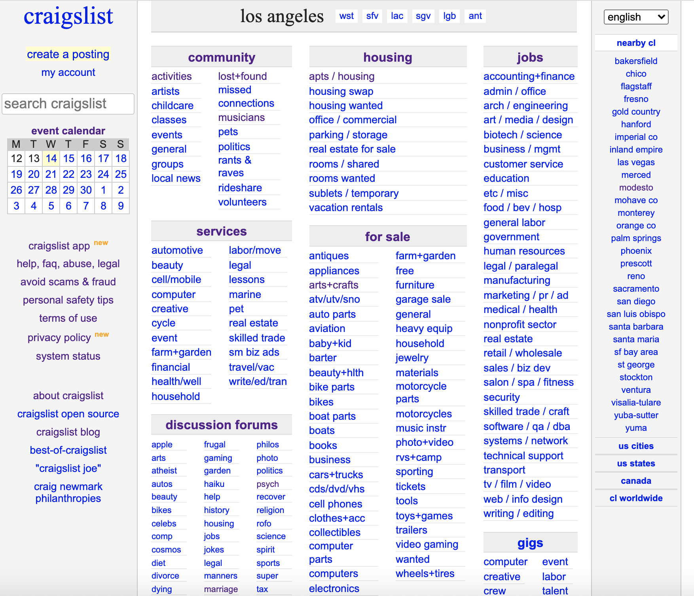

# Pilot Usability Test 
#### DH 110 Assignment 2 by Claire Dinauer

--------

## Introduction 

Craigslist has been a widely used website since its launch in 1995 for viewing and posting advertisements or listings. The website is known for operating like the classifieds section of a newspaper, displaying offerings for community service, jobs, housing, for sale items, and discussion forums. Over the years, its functionalities have expanded yet its aesthetic has remained fairly consistent. Hence, I am interested in performing a usability test for Craigslist to delve into its effectiveness, efficiency, and satisfaction based on users' behaviors and attitudes. This will enable us to learn more about how we can improve the website based on the user's perspective.

## Purpose of Usability Testing

Usability testing (UT) is essential to observing how people use products, specifically websites or apps in this case, while gaining a greater understanding of a product’s effectiveness, efficiency, and satisfaction. UT allows product creators to identify what users find good or bad about the web or app design. Specific issues can be identified by utilizing heuristic evaluation and task tests to determine the extent to which the web or app is effective, efficient, and satisfactory to users, as described above. Unlike heuristic evaluation, UT enables product creators to note participant’s behaviors, attitudes, and thoughts while navigating the product.

## Methodology

The pilot usability test will be conducted over Zoom software, with the moderator and participant both sitting in quiet spaces. The moderator and participant will both be using computers with webcams and audio on. The survey will be conducted through Google Forms. The participant will be screen sharing to display the survey and the website, so the moderator can see what the participant is doing while completing each task on the website. The moderator will screen record the Zoom conference to record the participant's reactions throughout the test. The screen recording will also include the moderator guiding the participant through the UT survey and tasks. This is a pilot trial, which is meant to test setting, materials, and software to improve the UT process. 

**Process of the usability test:**
* Introduction to the UT
* Informed Consent and Agreement
* Background Questions
* Pre-Test Questionnaire
* Tasks 
* Post-Test Questionnaire
* System Usability Scale (SUS)
* Product Satisfaction Card
* Demographics

The post-test questionnaire and SUS measure how the participant feels regarding the website's ease of use, efficiency, expected frequency of use, accessibility, aesthetics, and content organization. During the Product Satisfaction Card section of the UT, the participant selects five words that characterize their feelings and attitudes about the website, while speaking aloud.

**Tasks are as Follows:**

Heuristic | Usability Issue  | Task  |
:--- | :--- | :--- |
Error prevention  | The website automatically moves forward with every choice the user makes while creating a listing, without confirming their actions  | Create a posting for a particular location and topic | 
Aesthetic and minimalist design  | The website is cluttered, with nearly all possible topics listed out on the home page. The event calendar is oddly organized   | Finding an event to attend for particular dates |
Consistency and standards  | The discussion forums are inconsistently organized, particularly with a very different style than the rest of the website | Find and search through a specific discussion forum |

## Links to Survey and Video
* [Moderator Script/UT Survey](https://forms.gle/ykcCgg37MaNEwaaPA) 
* [UT video](https://drive.google.com/file/d/1XyIuLdEvbv8lesRAxNG4715Ekk8i5RSX/view?usp=sharing)

*Note for Dr. Cho: Access to edit and view the testing survey and responses is [here](https://docs.google.com/forms/d/1hBe1Mmp4fsfxIqDMuVbNi2WNbXbaHeIOO-kFogxCavU/edit?usp=sharing).*

## Reflection 

Overall, I think that the pilot testing went well. My participant was engaged with and interested by each task, and I felt comfortable asking additional questions when it felt necessary. My participant also felt comfortable asking me questions during the task to ensure that she was properly answering each question and completing each task. I think asking about the participant's expectations for each tab of the website helped me determine which parts of Craigslist were more user-friendly than others.

Because my participant had used Craigslist in the past, it was fascinating to ask her to navigate through different functions of the website that she had not used before. I think I could have done a better job of guiding her through the tasks without explicitly giving away what she would have to do to complete each task when I noticed that she was struggling. I tried to balance reading the instructions from the survey while remaining friendly and conversational to make her feel comfortable with sharing her thoughts throughout the survey. I also could have reminded her to explain her choices better during the post-test questionnaires to gain more insight into her attitudes toward the website and tasks.

Additionally, I think that I could improve the UT tasks by making them somewhat more specific to give the user more direction. This may also help with making sure each task is straightforward and that the user does not have to ask too many questions while navigating. I am also interested in constructing alternate tasks based on the heuristics I chose. I would also like to ask more open-ended questions during the pre-test questionnaire to get into the “why” of a participant’s scoring. Furthermore, I think that I should control and explain the UT survey on my end rather than the participant’s end. Overall, I think that conducting more UT tests with additional participants will help me figure out how to best gauge participant’s attitudes toward the site.
