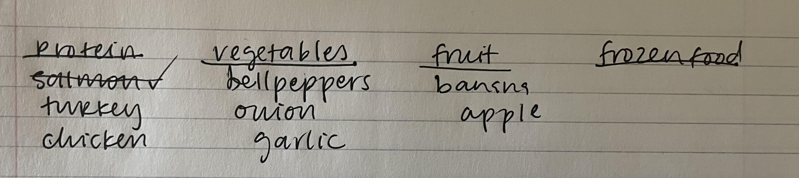
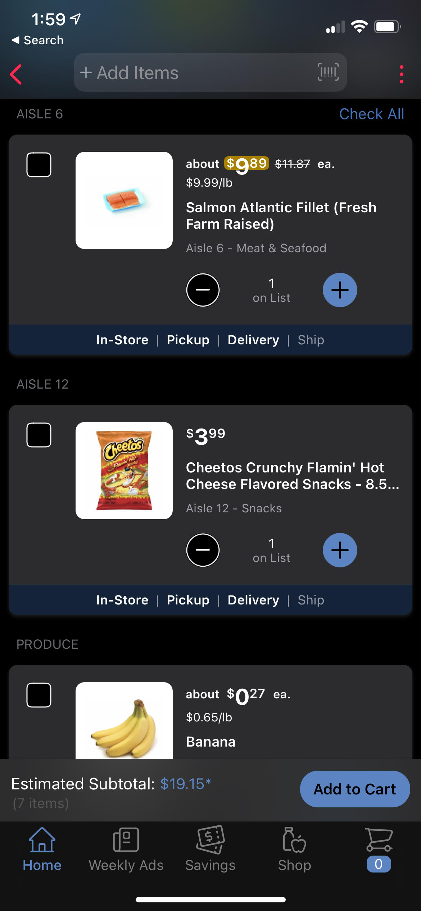

# Contextual Inquiry
#### *DH 110 Assignment 3 by Claire Dinauer*

--------

## Main Design Challenge

**What is the main activity your project would support the users’ needs?**

This project will support users in their ability to create a grocery shopping list that enables them to minimize their number of trips to different grocery stores, while maximizing savings. This will particularly help younger and older adults who live in areas with multiple grocery store options figure out where they can get the best deals for the items on their grocery lists.

**What is the basic need involved for that activity? (reference)**

This project addressess users' esteem needs, involving a sense of prestige and a feeling of accomplishment. While the project may seem to address physiological needs on the surface due to its enhancement of food accessibility, the project overarchingly targets users' esteem needs because users are likely to feel more accomplished after completing their grocery shopping in a timely, costly manner.

**What is(are) the traditional/current solution(s) to satisfy the needs?**

Many grocery stores and merchandise retailers that sell groceries have applications in which shoppers can curate a shopping list, view prices, add coupons, and view which aisles products are located in. In some applications, such as the [Ralph's app](https://apps.apple.com/us/app/ralphs/id584459861) or [Target app](https://www.target.com/c/target-app/-/N-4th2r?Nao=0), shoppers can add items to their list and check them off as they purchase them.

**What is(are) the limitation(s) that possibly would be improved with (digital) technology?**

Because applications for larger stores are specific to providing information regarding products and costs at that one store, an application that utilizes algorithms to compare costs of products and produce across multiple grocery stores will enable users to find the products that they are looking for at the lowest cost. In addition, rather than feeling limited to shopping at one store, users could set location preferences for where they would like to do their grocery shopping within a certain radius, as well as how many stores they may be willing to go to, in order to curate a shopping experience that works best for their time and wallet.

## Target Users 

#### What are the characteristics of users? (ex. demographics, preference, expertise) 

- **Demographics**: adults, people with families, students (high school or above), older adults
- **Preferences**: users who try to have organized, efficient shopping trips; users who try to go to more than one store to purchase different products; users who try to get the best price when shopping (e.g. clipping coupons, price comparisons)
- **Expertise**: users do not need a specific level of expertise for this project other than having the experience of grocery shopping

#### Where would the users do that activity? (i.e., context of use)

- Users can keep track of books anywhere; in the traditional method, as long as they have a piece of 
paper and pen, they can write down what book they read. 
In a digital method, users can log what they read anywhere at anytime, as long as they have their device.
- When finding books to read, users may do that activity in many different places—a library or a bookstore, 
or even in daily conversations with their family, friends, or co-workers, or online in an online book recommendation.  

#### What would the users do to complete that activity? (e.g., goal, operation, method, action)

- The goal of the users would be to log a book they read. To do that, they would either physically write down 
information about that book, or type it in a device to record information. To find a book to read, users may search online, 
go to a library or bookstore to browse books on their own or ask the staff, or ask their friends or family 
about book recommendations.

## Picking Research Methods

#### Methods
* I decided to use a combination of two methods: participatory observation and interview. 
  * For participatory observation, I observed 2 activities: logging a book by hand and finding a book to read in
  the Amazon Kindle store.
    * Logging a book by hand: I asked the user what a book log entry would look like, if she were to record the books she read.
    * Finding a book in the Kindle store: I asked the user how she would find a book she wants to read from the website, and 
    what she values when looking for a book to read.
* Both were conducted in the user’s own home, by their desk where they feel most comfortable. 
This would also be a place where they usually read books at home.
* I used an iPhone to voice record the interview and a laptop camera to record the user task.
* Because I could not find another in-person participant for these activity, unfortunately I had to ask the participant
from my usability test to complete these activities.

## Research Materials: Script and Videos

**1. Contextual Inquiry Guide:**

The **script** that I used during the interview can be found [here](https://docs.google.com/document/d/1z0tS3uKGUXR-qxgvsAQXRfvZ3kCcMeRtiJcfXVORXyM/edit?usp=sharing).

**2. User Data:**

The **videos** for the recording of the interview and the screen-recording of the participant using the Ralph's app can be found in [this folder](https://drive.google.com/drive/folders/1thzUt6qQAJquKfegJAGIs1oqi27d4Cx0?usp=sharing). The following contents are  in the folder:

- [Interview: Video Part 1](https://drive.google.com/file/d/1EWsEouL3s9KMMKDCbU4_pazDJfKBqfHk/view?usp=sharing)
- [Interview: Video Part 2](https://drive.google.com/file/d/168pTi7WWqnbS4iUs5tr225mi8VE0FP2J/view?usp=sharing)
- [Ralph's App Screen-Recording](https://drive.google.com/file/d/1mrqzZi-mn4on7CcugSrnu363fompKxew/view?usp=sharing)

*Note: The video recordings were split into a "Video Part 1" and "Video Part 2" due to recording difficulties.* 

The **transcript** of my conversation with the participant can be found [here](https://docs.google.com/document/d/1TCI9dWgIZDmvxE3PBr5gTxNf1ytt21VWozHf8VS1yI0/edit?usp=sharing).

The **written list** created by the participant on paper can be viewed below:

The **digital list** created by the participant in the Ralph's app can be viewed below:

## Reflection

In github (sub)repository assignment4, create one document (either README.md or .html)
Describe your project design challenge + target user (step1+2)
Describe your research methods and plan (step3)
Provide a link to your interview/observation guide (step4) 
Digitize your notes (scan/photo) and upload your data to github
Provide a link to your representative data file(s) (step5)
Provide a link to the transcript of your interview (or meaningful dialogues/ talk-aloud during observation, useful transcript tool here) 
Write a reflection
