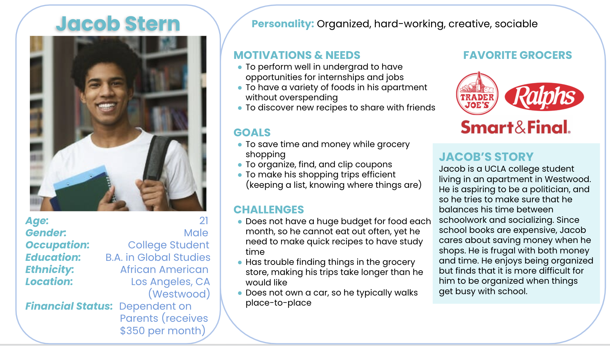
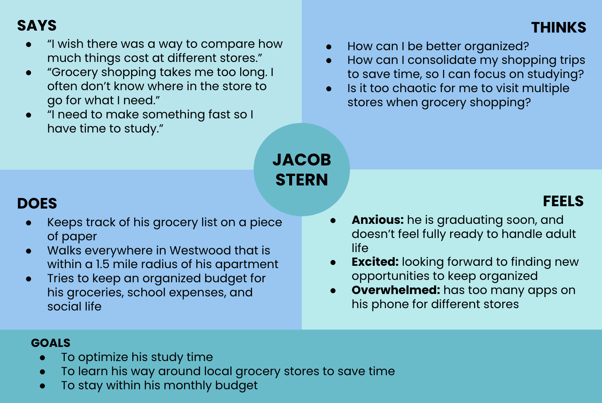
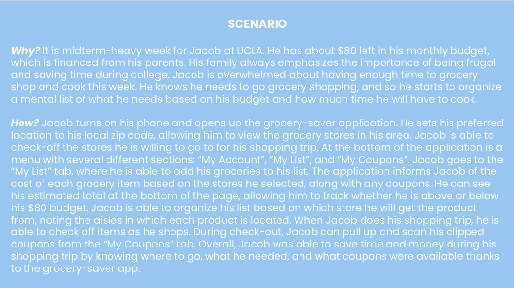
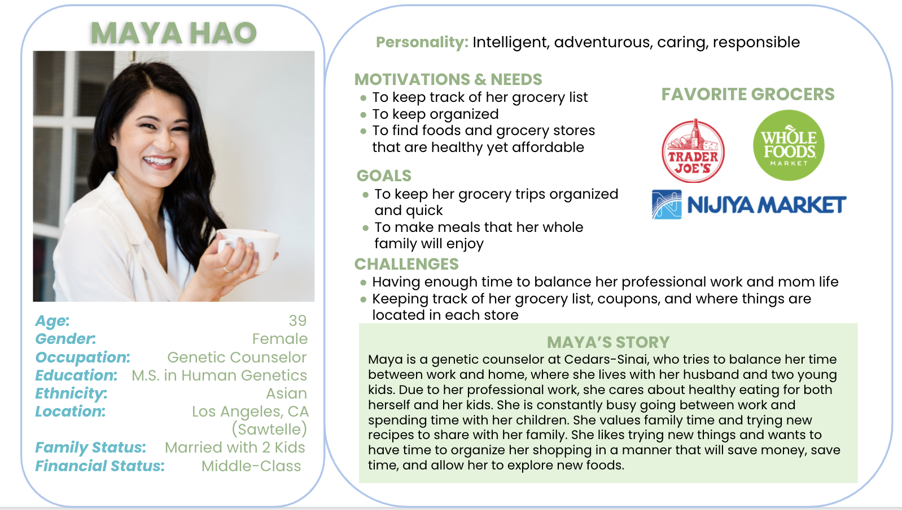
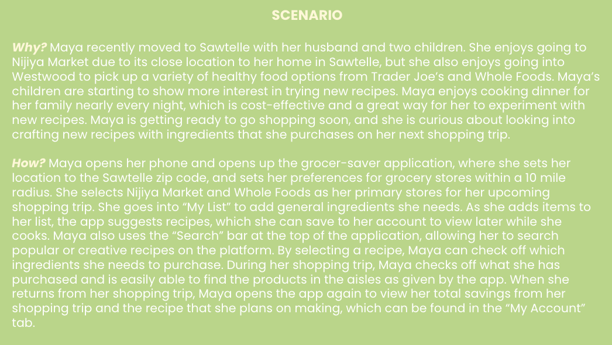

# UX Design of a Public Library Website
DH 110: Persona + Scenario by Claire Dinauer

## 🗣 Purpose of UX Storytelling

The purpose of UX storytelling is to better understand the user by considering their world view and perspective when encountering different aspects of life. UX storytelling enables design teams to create personas based on their target audience, allowing them to consider the behaviors, thoughts, and environments of their users. Storytelling opens the door to considering user's emotions as they navigate scenarios that are relevant to the product. This allows teams to combine a range of consumer experiences to develop a dynamic, user-friendly product.

## 👤 Key Design Features
1) Digital shopping list with suggested coupons
2) Aisle labeling for each product in the shopping list
3) Recipe recommendations based on the shopping list

## 👥 Personas and Empathy Maps

### 🚶🏼‍♂️Jacob Stern

#### 1. Jacob's Persona

#### 2. Jacob's Empathy Map

#### 3. Jacob's Scenario

#### 4. Jacob's Journey

### 🚶🏻‍♀️Maya Hao

#### 1. Maya's Persona

#### 2. Maya's Empathy Map

#### 3. Scenarios

#### 4. Maya's Journey

