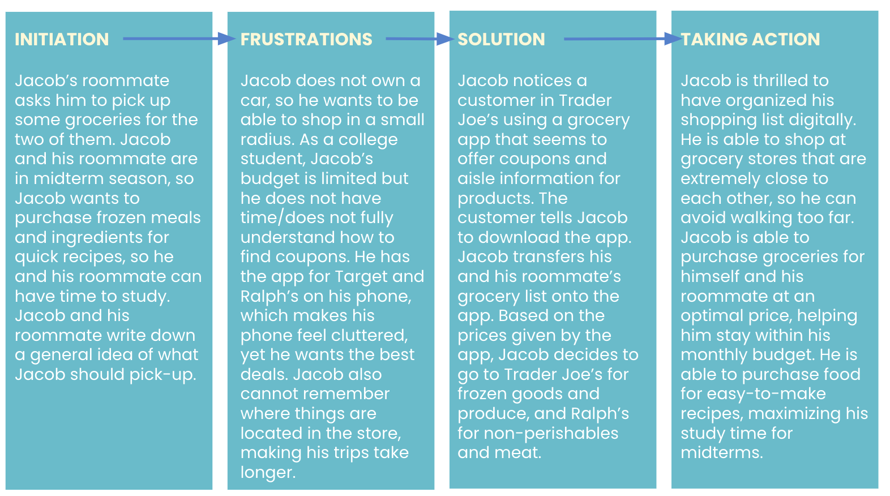
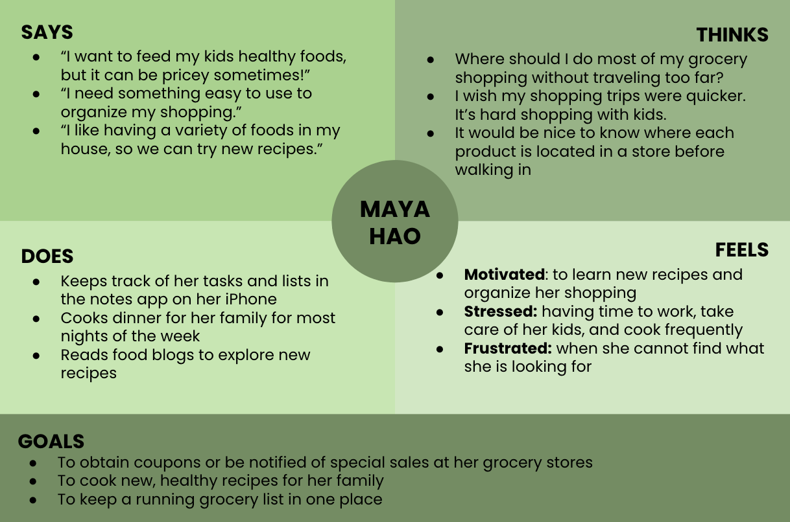
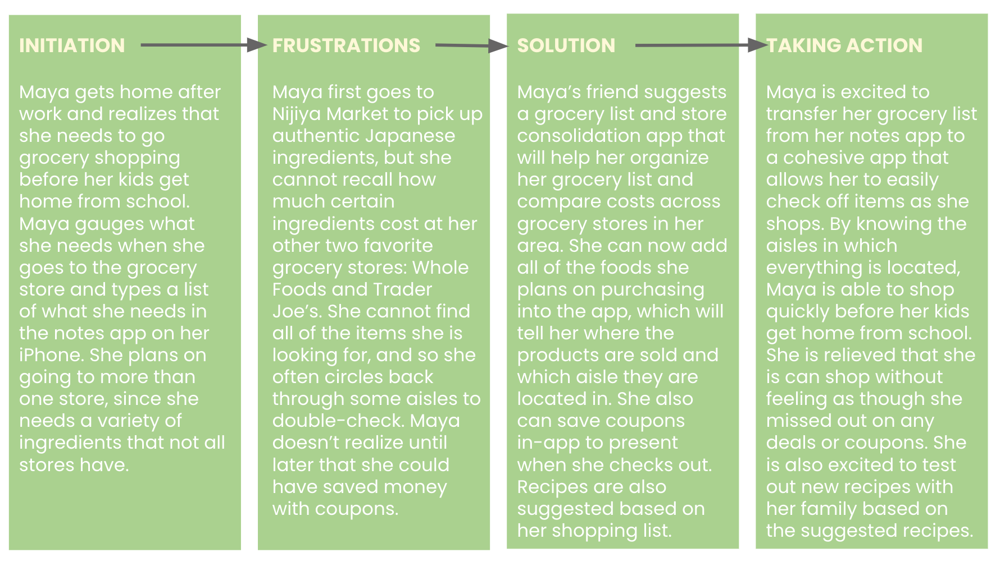

# UX Design of a Public Library Website
DH 110: Persona + Scenario by Claire Dinauer

## Purpose of UX Storytelling

The purpose of UX storytelling is to understand the user; it allows design teams to gain insights into their users’ thoughts, behaviors, actions, and contexts. In addition to this, it allows team to connect quickly, to establish an agreed upon perception of their user, so that they may work effectively to design a cohesive product.

## Key Design Features
1) the library catalog
2) the search function within the library's website
3) the library website's organization of information/page titles

## Personas and Empathy Maps

### Peter Stern

### Maya Hao

### Reflection
