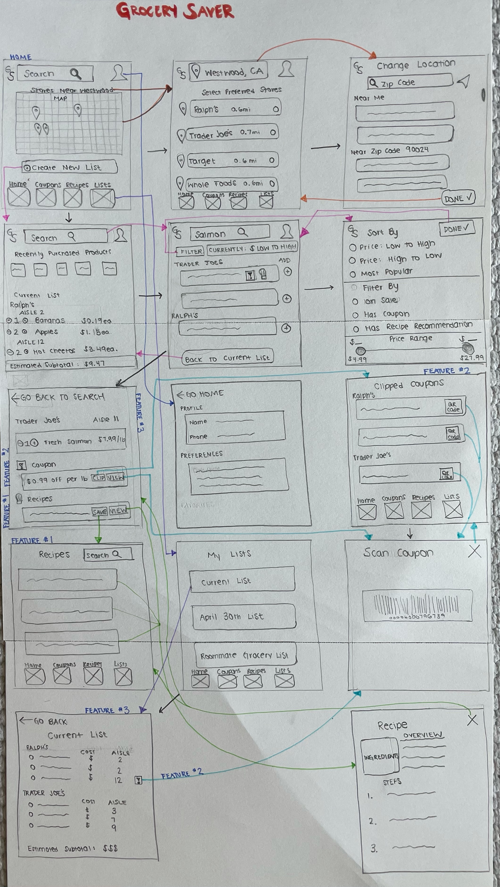
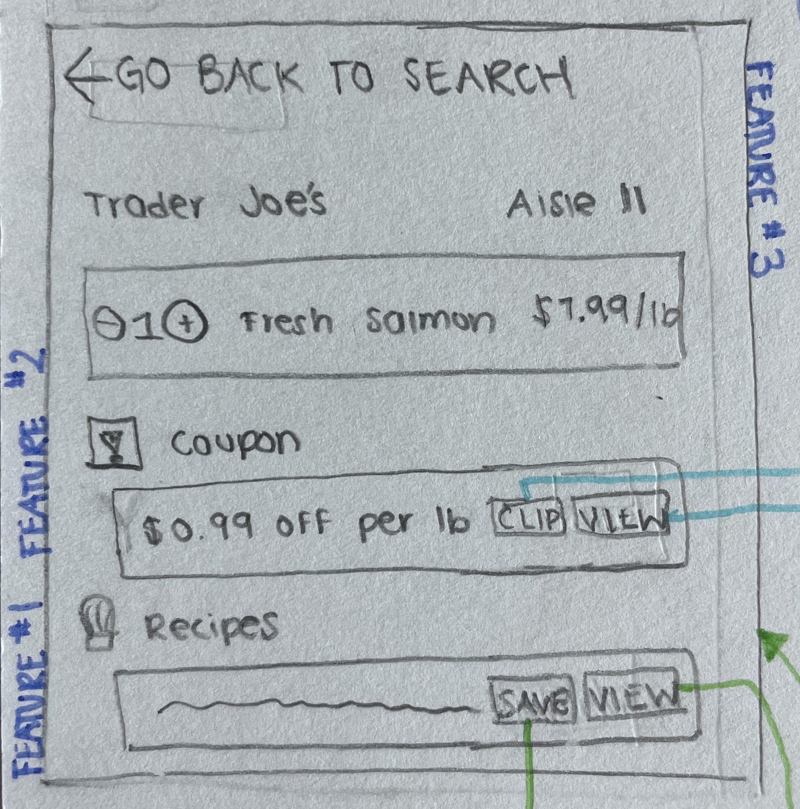

# Low Fidelity Prototype for GrocerySaver
DH 110: Low Fidelity Prototype by Claire Dinauer

## Project Description

This low-fidelity prototyping project aims to assist users with the efficiency and cost of their grocery shopping trips. The target audience is for any young adult and older who does their own grocery shopping, or shops for their family, who seeks to save both time and money. These users likely have busy lives, whether as students, parents, or full-time workers, who may want to have more time to spend with their family or doing hobbies outside rather than spending too much time circling the grocery store looking for products and spending more money than necessary. Based on my user research, the following features are focused on helping users save time and money when creating their shopping lists and conducting their grocery trips:

1. **Recipe Recommendations** - recommends what recipes users can make based off the items they are adding to their shopping list  
2. **Coupons Tool** - recommends coupons for users based on the items they are adding to cart, in which users can digitally save the coupons their device to use at check-out  
3. **Aisle Labeling** - indicates where users can find each item in their respective store, as well as an overall summary list of the aisles in which the user will need to visit

My target users were created around the ideals of a balance between cost-efficient and time-efficient shopping, enabling users to take advantage of multiple stores in their area, if applicable. My two personas were a 21-year-old college student and 39-year-old genetics counselor and mother, each of whom desired more time focusing on their priorities (i.e. studying or spending time with family). My personas also prioritize ease of organization and making the most of their budgets. The college student wants to know his way around his university's local grocery stores, while optimizing his study time and staying within his monthly budget. The full-time genetics counselor/parent wants to seek new recipes for her family and to keep her grocery lists and coupons organized.
*View Personas and Scenarios [**Here**](https://github.com/clairedinauer/DH110-Dinauer/tree/main/assignment4).*

**Project Purpose:** Overall, the purpose for conducting this low-fidelity prototype is to test the functionality and ease-of-usability of the features that I designed with my target audience in mind. I want to gauge the efficiency of each of the features and understand what may be confusing to users, allowing me to figure out what I may need to adjust in my GrocerySaver application to ensure that users get the most out of each feature and the application as a whole.

## Flow and Description

**Flow Description:**
The flow designed below is meant to allow users to see how they can set or change their location, search for products, as well as select and view products, coupons, and recipes. The user can access information about their profile through the face icon in the top right corner of the home page. On the home page, there is a search bar which can be used to search products, coupons, or recipes. The menu at the bottom of the home page allows users to know where they are in the app and easily access the home, coupons, recipes, and lists pages. There is also a button to "Create a New List", which directs users to a search page with their current list, their recently purchased products, and a search bar at the top to search products. When users search a product, they can view the product in all of the stores that they selected in their location preferences. They can set preferences and filters for products, such as price and whether the product is on sale, has a coupon, or has a recommended recipe. Users can identify whether a product has a coupon or recipe based on icons in the product description. When they click on a product in a particular store, users can view the price, aisle, coupon, and recipes. in addition to being able to add the item to their list. When looking at the overview of their current list, users can see the products on their list organized by store and aisle. Users can click on the coupon icon next to their products to scan any discounts and can view their estimated subtotal on the bottom of page.

 
 

**Features Description:**
> 1. Recipes: The "Recipes" button is located at the menu at the bottom of the home and several relevant pages. The user can click this button to view all of their recipes, in which they can search through their saved recipes. Users can also note whether an item has recommended recipes if the item has a chef's hat icon next to it.
> 2. Coupons: The "Coupons" button is located at the menu at the bottom of the home and several relevant pages. The user can view all of their clipped coupons for each relevant store, and click on the coupon to open up the scannable code for check-out. Users can see if an item has a coupon if it has a box with an exclamation point next to it.
> 3. Aisles: The user can view the aisles in which each item is located when viewing more specific details about the product in a store and when viewing their "Current List".

*Features are labeled numerically in the flow above, and all three features are identifiable in the product information page below.*

 
 

## Test Scenarios

To test each feature, I asked my participant to do what she thought she should do in different scenarios. I asked her to circle and/or draw what she would do, as well as write down what she did for clarity.

1. **Recipe Recommendations:** asking the user to find a recommendations for recipes based on their desired products.
> *Participant Insight:* My study participant was able to successfully access the "Recipes" icon, in which they stated they would search through the recipes that they had. However, my participant was confused about whether she would only have access to recipes she saved or any recipes on the app. She also did not notice that she could search through products to see what had recipe recommendations.
> 
> *What I Would Change:* I would make it clear that users can use the search section of the recpies page to look up any recipes they were interested in. Moreover, I would develop a feature that allows the user to add any ingredients that they needed to their shopping list directly from the recipe that they are interested in making.

 
 

 
2. **Coupons Tool:** asking the user to look for an item with a coupon, then clip the coupon, and view their coupons during check-out.
> *Participant Insight:* My participant successfully found how to clip the coupon and view their coupons. She figured out how to search products and view the product to see the coupon. However, she was confused about the icon for the coupons. She also did not like that the coupons page only included clipped coupons. She stated she expected that navigating to the "Coupons" page should include recommended coupons for past products added to her list or popular coupons.
> 
> *What I Would Change:* I would take my participant's recommendations to change the structure of the coupons page to include recommended/popular coupons. I would also change the coupon icon to make it look less like a warning and more like a coupon. I also could possibly add a section to the list creation page that shows "coupons you may like" below the "recently purchased products" section.

 
 

3. **Aisle Labeling:** testing whether the user can construct a shopping list and view the aisles in which their items are located
> *Participant Insight:* My participant successfully found the aisles in which the items were. She liked the organization of the aisles on the "Current List" page as organized by store. She stated that this feature was located where she mainly expected it to be.
> 
> *What I Would Change:* I do not think I would change much about the aisle labeling feature, other than possibly offering an aisle-specific page that includes an "other items found in this aisle" section.

 
  
 

## Reflection

+1: Summary of the process, what went smoothly or differently from your expectation

+1: What you would change or design differently based on the feedback you got from the prototype testing. 

