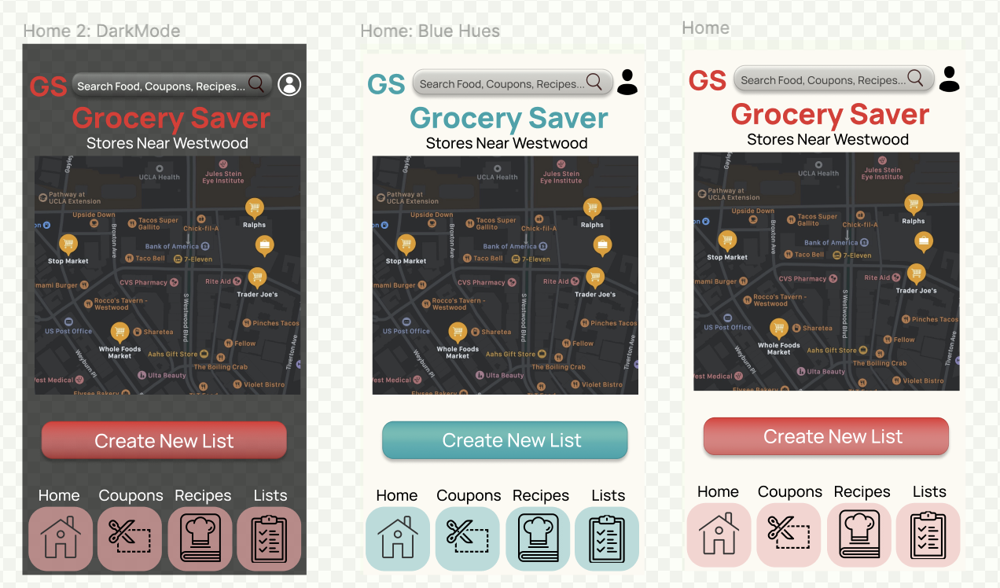
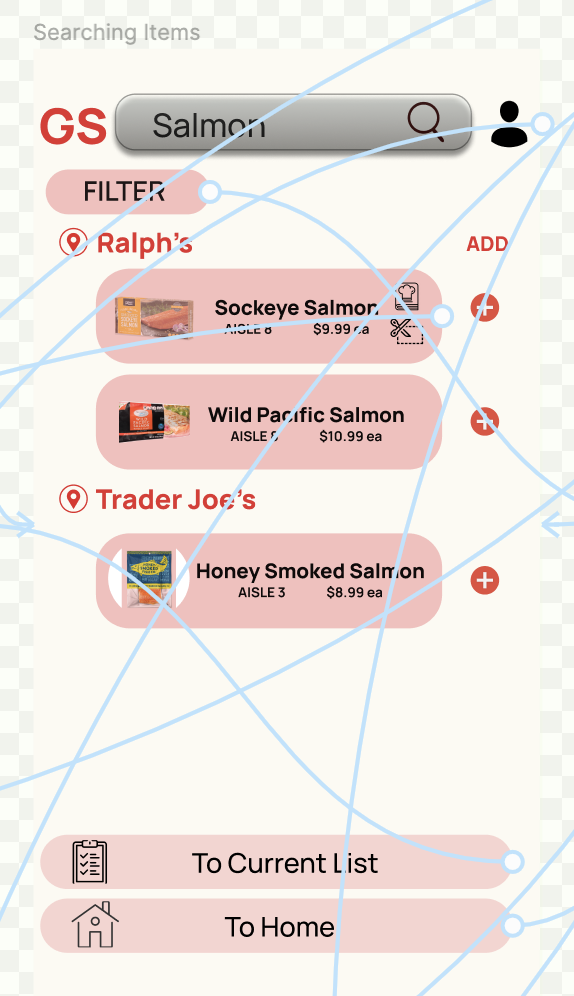
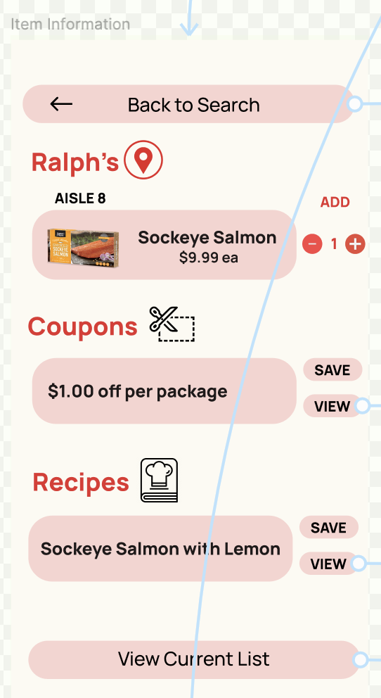
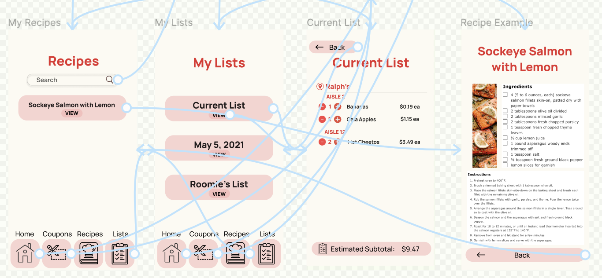
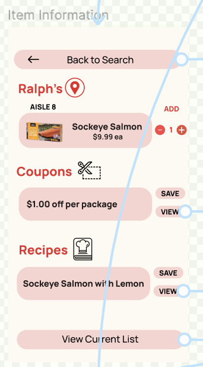
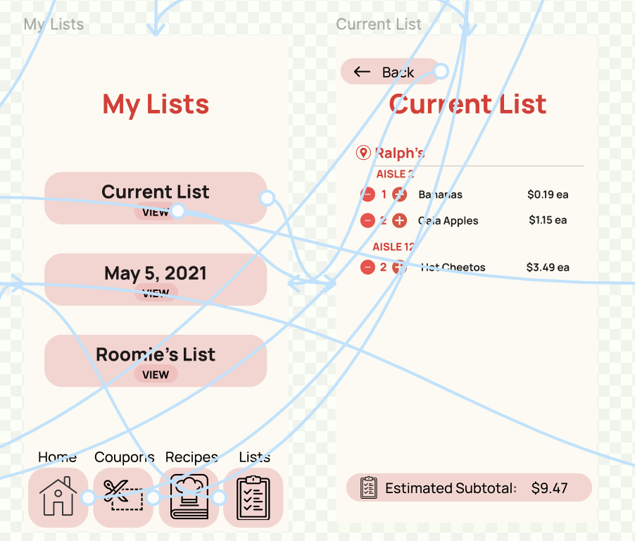
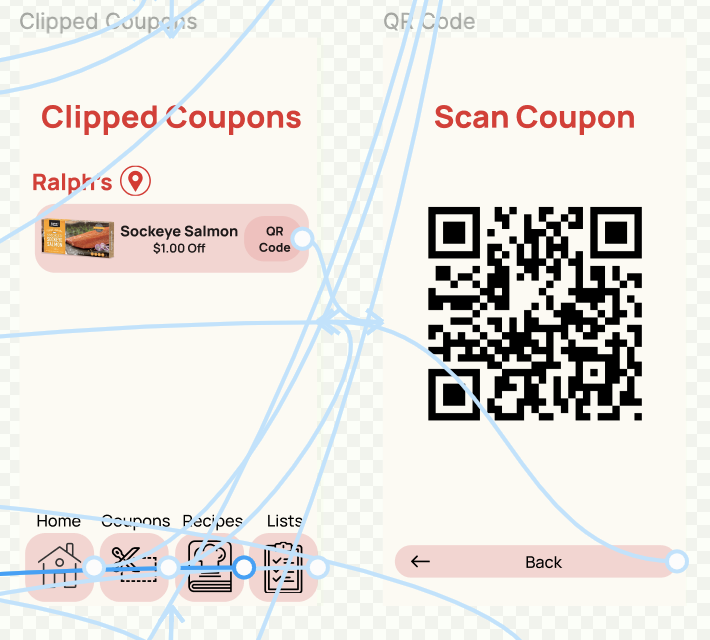

# High-Fidelity Prototype for GrocerySaver
DH 110: High Fidelity Prototype by Claire Dinauer

## Project Description

This project is for my GrocerySaver app, in which I am adapting my [low-fidelity prototype](https://github.com/clairedinauer/DH110-Dinauer/tree/main/assignment5) to a high-fidelity prototype format using Figma. The purpose of creating a high-fidelity prototype is to develop, visualize, and engage with a functional version of my app to ensure that the GrocerySaver app is user-friendly and testable. I originally created hand-drawn wireframes and wireflows for my low-fidelity prototype based on my two user personas [Jacob Stern and Maya Hao](https://github.com/clairedinauer/DH110-Dinauer/tree/main/assignment4). Based on user feedback from a test participant, I was sure to make relevant adjustments to my wireflow to be incorportated into the high-fidelity prototype, with improved features, graphic design, and UI/UX material components.

## About the Prototype

This prototype allows users to utilize the following tools:

1. **Recipe Recommendations** - recommends what recipes users can make based off the items they are adding to their shopping list  
2. **Coupons Tool** - recommends coupons for users based on the items they are adding to cart, in which users can digitally save the coupons their device to use at check-out  
3. **Aisle Labeling** - indicates where users can find each item in their respective store, as well as an overall summary list of the aisles in which the user will need to visit

## Screen Design
 
For my design, I included the above features and tools while focusing on making sure that my app looked neat, readable, and accessible. I included icons with relevant words, such as the house for the home page, chef's hat for recipes, and a notebook/list icon for the lists. I aimed to make any back buttons more intutive by also including arrows. There are three variations of the home page with different colors.

 
 
 
 
 

 
### Decisions

**Font:** I used the Manrope font with a variety of boldness and text size between 16-30. Spacing was 1.5 where applicable. I was otherwise sure to place any elements a consistent distance apart on each screen.

**Buttons**: To direct users' focus, I created buttons with additional graphics or icons to give users' insight into where they will be redirected.

 

 
 

## Color Scheme and Variations
 
### Three Different Hues

I created a basic home page, darkmode home page, and a homepage with blue hues, as shown below. I then tested out the accessibility to viewing these colors using the Color Tool interface.

 
 

 
 ### Color-Contrast Check
 

 
 
 
 
 

 
## Interactive Wireflow and Tasks

### Wireflow

I created 15 frames on Figma with which participants could interact with my high-fidelity prototype. Three of the 15 frames are different versions of the home page in varying hues, as shown above. Users can access the "light mode" and "dark mode" of these home pages by tapping on their profile icon to access their profile and settings, then select light mode or dark mode in preferences.
- The link to the wireflow can be accessed [**here**](https://www.figma.com/file/LLdDPIvlSZuc4WtEQ4rh4c/High-Fidelity?node-id=0%3A1). 
- The interactive prototype can be accessed [**here**](https://www.figma.com/proto/LLdDPIvlSZuc4WtEQ4rh4c/High-Fidelity?node-id=157%3A29&scaling=scale-down&page-id=0%3A1).

 
 

 
### Task #1
 
**Recipe Feature:** For the first task, I asked my participant to start a product search and look for Salmon that would include a recipe. I then asked the participant to "save" the recipe, and go to their recipes to open and view it. 

To carry out the task, the participant is expected to start on the home page, then use the search feature at the top of the page to begin searching for the Salmon. Looking at this search screen, the participant would then be expected to tap on the Sockeye Salmon, which has a recipe and coupon icon. The participant could then "save" or "view" the recipe to look at at. If they "save" the recipe, the participant could view it from their "Recipes" page. The following screenshots of my wireframe depict the main frames that I intended for the participant to use to complete this task.

 
 
 

 
 

 
 

 
### Task #2

**Aisle and Coupons Features:** For the second task, I asked my participant to check their preferred location and confirm that Trader Joe's and Ralph's were selected as their stores. I then asked the participant to create a new list, search for Salmon, choose the Salmon with a coupon, and open the coupon to view the QR code. I asked the participant to then view their current list and tell me where their products are located in each store and their estimated subtotal. 

The participant is expected to complete this task by clicking on the map or location text on the home page to check their location. Then, they should click on the "Create New List" button, which will take them to a search and current list page. They will again navigate to the search page via the search bar, where they can "search" for salmon, find the coupon, and view the QR code. Then, they are expected to go to their "lists" page to access their current list and see where the products on their list are located in the respective stores along with their subtotal. The following screenshots of my wireframe depict the main frames that I intended for the participant to use to complete this task.

 
 
 

 
 

 
 

## Cognitive Walkthrough of Tasks

The cognitive walkthrough video for the above tasks can be viewed [**here**](https://drive.google.com/file/d/13Ja2a8IxbzpzPuKLzyjLlgQ4pSWs11_I/view?usp=sharing).
- Task 1: 0:00-0:54
- Task 2: 0:54-2:24

I also conducted a cognitive walkthrough with a participant to test usability. The video recording can be accessed [**here**](https://drive.google.com/file/d/1ghwZbRHsA5A8UHsrU5R-wzeu03ML3NoN/view?usp=sharing).

**Summary:** By carrying out the cognitive walkthrough myself, I noticed where some parts of my app may be confusing. For example, I was having trouble with clicking the "back" buttons for my recipe and QR code pages, which ended up directing me to my recipes page and my coupons page rather than the actual last page I had been on. Hence, I need to look into how to direct the back button based on previous actions of the user. I also noticed that some of the icons for my buttons were not showing up, which is also an issue I need to fix to help users with clarity of where a button with direct them. I specifically had this issue on the location adjustment page. Additionally, by watching my participant carry out these tasks, I was able to note what she intuitively clicked on based on the tasks asked of her. I realized that I may need to make the search bar on the home page larger, as it seemed as though she did not fully realize that it was there for use.

## Impression Test Quotations

I interviewed a friend as my participant to gauge their first-impressions of the app, its design, and functionality. Below are some of the most relevant quotations from our conversation.

Most relevant or helpful comments:
- "I like the color scheme with the reds"
- "I think the app is helpful. I wish I could use something like this"
- "You could probably use some X-out buttons instead of back buttons since it looks confusing when some different screens lead to the same thing" 
- "The colors make me think of Ralph's or Doordash colors so the red makes sense"
- "It's hard to tell the recipes just from the name and no pictures"
- "It's a little odd that the coupons have photos but recipes don't but it's clear enough since there is only one recipe there for now, but otherwise would be hard"
- "The recipe search looks different than the other search bars"
- "I can't really tell where to click for the maps? I guess it makes sense to click on the map itself but there is not a button for the text so I'm confused"

**Summary:** My participant as highly receptive to the color scheme and font that I used. Having my participant walk through the tasks I expected of my target users. By walking through the search, coupon, and recipe features, my participant was able to give me insight into what did and didn't work about my design beyond aesthetics, moreso able to gauge the clarity of its functionality.

## Reflection

+1: Summary of the process, what went smoothly or differently from your expectation

+1: What you would change or design differently based on the feedback you got from the prototype testing. 
